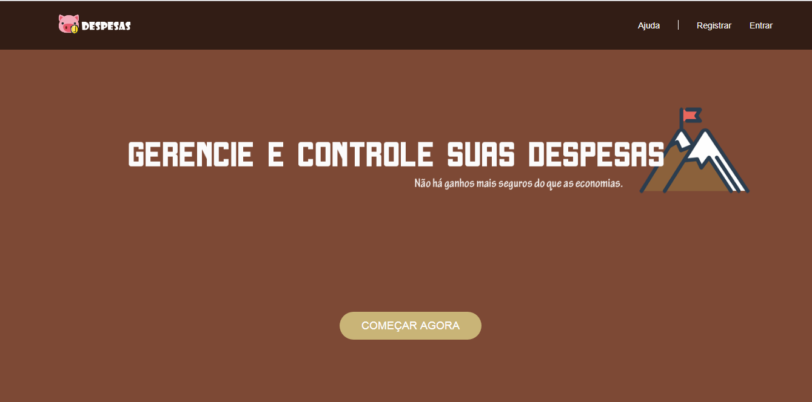

# despesas

sistema de controle de despesas.

O sistema conta:
Tela de login com diversas verificações;
Gráficos;
Cadastros: Cadastro de clientes, produtos, contas a pagar, receber. Foi utilizado máscaras nos campos através de plugins como Jquery, MaskMoney.
Cruds completos.
Consultas com filtros e relatórios.

*Foi utilizado bootstrap, Jquery, Html, Css.
*Banco de dados: Mysql
*Relatórios: MPDF
*Gráficos: Google Chart

